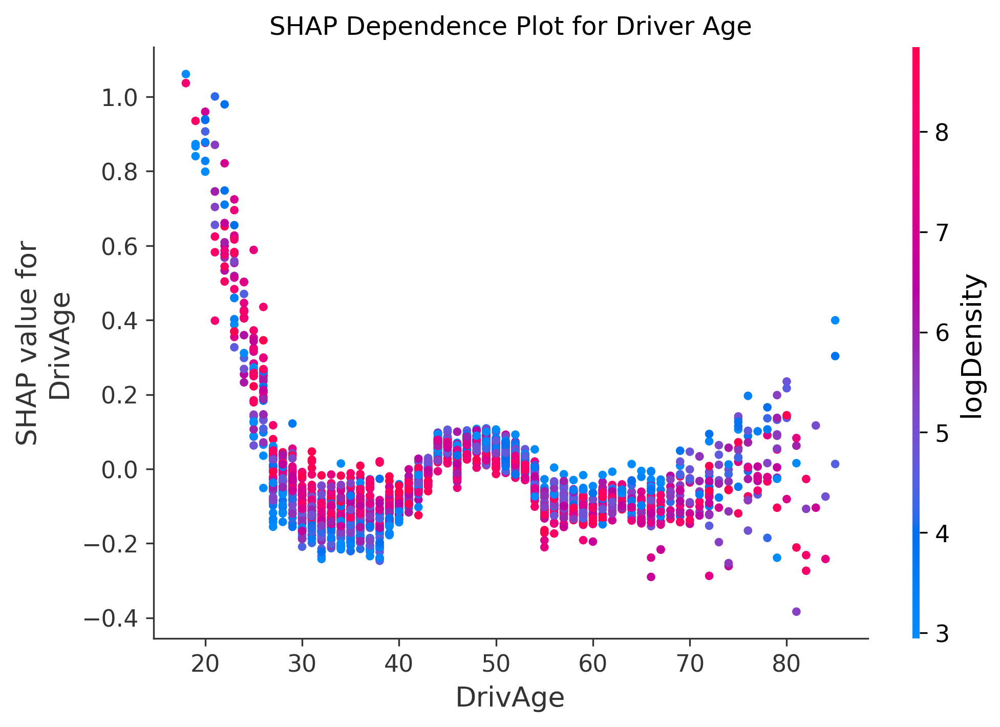
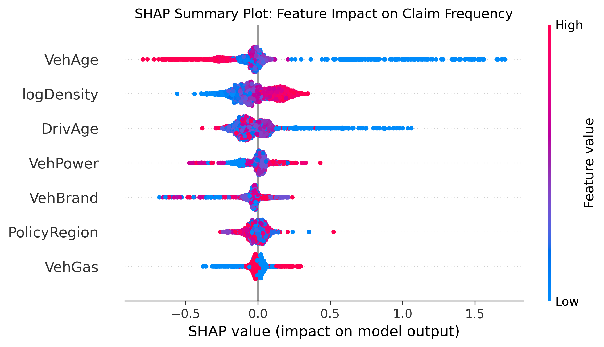

# Technical White Paper: Actuarial Pricing Analysis
**Benchmarking GLM, XGBoost, and CANN for MTPL Frequency Modeling**

## 1. Problem Statement
Traditional actuarial pricing in P&C insurance relies on decomposing the **Pure Premium** into **Frequency** (number of claims per unit of exposure) and **Severity** (average cost per claim).

This study addresses the modeling of **Claim Frequency** for a Motor Third-Party Liability (MTPL) portfolio. The primary challenges inherent in insurance data include:
* **Sparsity:** The vast majority of policyholders do not report claims (excess of zeros).
* **Non-linearity:** Relationships between risk factors (e.g., driver age, vehicle power) and frequency are often non-linear.
* **Variable Exposure:** Policyholders enter and exit the portfolio at different times, requiring the use of an **offset** to normalize counts.

The objective is to outperform traditional benchmarks while maintaining the transparency required by insurance regulators.

## 2. Dataset Analysis
The study utilizes the **French MTPL dataset (OpenML ID: 41214)**, a recognized industry standard. The dataset comprises approximately 670,000 policies:
* **Target:** `ClaimNb` (Number of claims).
* **Exposure:** `Exposure` (Duration of coverage in years).
* **Features:** A mix of categorical (Area, Vehicle Brand, Fuel) and numerical (Age, Power, Population Density) variables.
* **Data Cleaning:** We applied **exposure clipping** (capped at 1 year) and removed claim count anomalies to ensure the models estimate a representative portfolio mean unaffected by extreme outliers.

## 3. Modeling Framework Overview
We implemented a hierarchy of models to test varying levels of complexity:
1.  **GLM (Poisson Regression) - The Benchmark:** The industry and regulatory standard.
2.  **XGBoost (Extreme Gradient Boosting):** State-of-the-art tree ensemble for tabular data.
3.  **CANN (Combined Actuarial Neural Network):** A hybrid architecture integrating GLM structures with dense neural layers.

## 4. Detailed Model Analysis

### A. GLM (Generalized Linear Model)
The model assumes the target follows a Poisson distribution with a $\log$ link function.
* **Technical Optimization:** Following professional peer-review (M. Mayer, 2024), the solver was migrated from `lbfgs` to `newton-cholesky`. While both converge to the same deviance, the latter is mathematically superior for GLMs when $N_{samples} \gg N_{features}$, providing a more robust and direct convergence path.
* **Pros:** High interpretability; regulatory transparency.
* **Cons:** Fails to capture complex feature interactions automatically.
* **Performance:** Poisson Deviance of **0.5923**.

### B. XGBoost
* **Pros:** Automatically captures non-linearities. Robust to unscaled data.
* **Cons:** "Black Box" nature, addressed via **SHAP**.
* **Performance:** Poisson Deviance of **0.5646** (**4.67% improvement**). **Champion Model**.

### C. CANN (Neural Network)
* **Pros:** Captures intricate signals missed by gradient boosting.
* **Cons:** High sensitivity to hyperparameters and normalization.
* **Performance:** Strong convergence (**0.3089** on preprocessed scale), demonstrating the potential of deep learning for future pricing iterations.

## 5. Conclusions
The study demonstrates that adopting Machine Learning (XGBoost) yields a significant **4.67% improvement** in risk estimation.
* **Accuracy vs. Interpretability:** SHAP integration ensures transparency.
* **Actuarial Rigor:** Rigorous exposure management and Poisson-specific metrics align this work with modern NatCat and Pricing standards.

---

## Appendix I: Interpretability & Governance via SHAP

In a regulated environment (e.g., Solvency II), model governance is paramount. We implemented **SHAP** to decompose XGBoost predictions.

### 1. Local Additive Model
SHAP ensures consistency and additivity. Every prediction is decomposed starting from a base value (global mean frequency), adding the marginal contribution of each variable. This makes XGBoost "locally explainable," similar to a GLM at the individual policy level.

### 2. Non-Linear Interaction Analysis
One of the major competitive advantages of our approach is the ability to visualize **SHAP Dependence Plots**.

* **Example - Driver Age:** While a GLM assumes a rigid functional form (or requires binned features), SHAP revealed how the impact of age interacts with vehicle power.
* We observed that the risk increase for young drivers is not constant but accelerates sharply above a certain `VehPower` threshold. Identifying these interactions is crucial for more refined risk segmentation.

### 3. Global Interpretability for Business Strategy
Through the **SHAP Summary Plot**, we gained a comprehensive view of the portfolio's risk drivers:

* **Bias Identification:** We verified that the model does not use "proxy" variables for sensitive or unethical information, guaranteeing algorithmic fairness.
* **Risk Ranking:** `VehDensity` (population density) emerged as one of the strongest predictors of frequency, confirming the actuarial intuition that urban traffic is the primary catalyst for MTPL claims.

### 4. Regulatory Value
In audit scenarios, the integration of SHAP addresses key requirements:
* **Transparency:** Identifying exactly which variables influenced a specific premium.
* **Justifiability:** Ensuring that feature impacts (e.g., Bonus-Malus) align with actuarial theory.
* **Reliability:** Validating that the model relies on real risk signals rather than statistical noise.

---

## Appendix II: Mathematical Foundations of Shapley Values

### 1. Axiomatic Definition
Shapley values (Lloyd Shapley, 1953) are the unique attribution method satisfying four axioms: **Efficiency**, **Symmetry**, **Dummy**, and **Additivity**. In pricing, **Efficiency** is critical: it guarantees the sum of feature contributions equals the difference between the point prediction and the global average.

### 2. The Formula
For a set of features $F$, the Shapley value $\phi_i$ for feature $i$ is the weighted average of its **marginal contribution** across all possible coalitions:

$$\phi_i(f) = \sum_{S \subseteq F \setminus \{i\}} \frac{|S|! (|F| - |S| - 1)!}{|F|!} [f(S \cup \{i\}) - f(S)]$$

Where:
* $S$: A subset of features excluding $i$.
* $f(S)$: The model output evaluated using only features in $S$.
* $[f(S \cup \{i\}) - f(S)]$: The marginal contribution of adding feature $i$ to coalition $S$.

### 3. TreeSHAP Optimization
As exact calculation requires $2^{|F|}$ coalitions, we utilized **TreeSHAP**. This algorithm optimizes the process for tree-based models (XGBoost), calculating values in polynomial time $O(TLD^2)$ by tracking tree paths, enabling the analysis of large-scale datasets like the French MTPL efficiently.