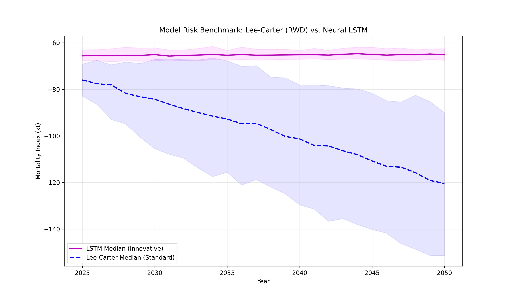
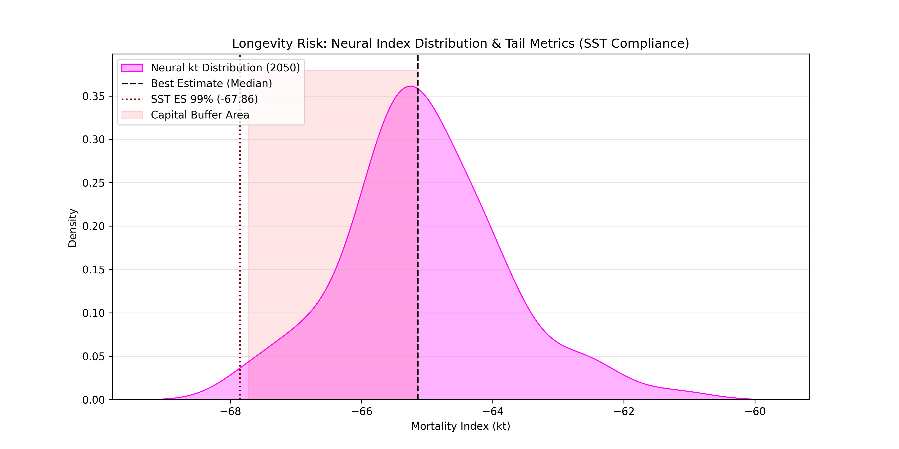

# Project 03: Longevity Risk & Neural Uncertainty (Switzerland)

This repository implements a **State-of-the-Art Longevity Risk Framework** tailored for high-income populations. By transitioning from traditional linear extrapolations to **Probabilistic Deep Learning (LSTM + MC Dropout)**, the framework identifies recent mortality "regime shifts" and quantifies the capital buffers required under **Swiss Solvency Test (SST)** and **Solvency II** standards.

## Key Technical Features
* **Sequential Intelligence:** LSTM-based modeling with a 10-year look-back window to capture structural mortality plateaus.
* **Bayesian Uncertainty:** Quantification of **Epistemic Risk** through Monte Carlo Dropout (100 stochastic simulations).
* **Regulatory Calibration:** Automated calculation of **Expected Shortfall (ES 99%)** and **Value-at-Risk (VaR)** for SCR calibration.
* **Audit-Ready Pipeline:** A modular 4-stage workflow ensuring full transparency from raw HMD data to risk metrics.

## Visual Insights & Benchmarking

### 1. The "Mortality Derby" (Model Selection)
The framework was validated via backtesting (2011-2024). The LSTM outclassed classical benchmarks by adapting to the recent slowdown in mortality improvements, preventing the over-optimism inherent in the Lee-Carter model.

| Model | RMSE (Backtest) | Risk Management Insight |
| :--- | :--- | :--- |
| **SVD Lee-Carter** | 0.1682 | Rigid baseline; fails to detect decadal trend shifts. |
| **Hybrid Residuals** | 0.1536 | Improved graduation but retains linear drift bias. |
| **LSTM Champion** | **0.1174** | **Superior adaptation to the Swiss mortality plateau.** |

### 2. Model Risk & The "55-Point Prudence Gap"
A core finding of this study is the divergence between neural and stochastic benchmarks. By 2050, the **LSTM Median Projection is 55.27 points higher** than the Lee-Carter trend, highlighting a significant **Model Risk** where standard benchmarks may be under-reserving for longevity liabilities.

### 3. Capital Requirements (SST Metrics)
The framework generates a full probability distribution for the 2050 mortality index. Following international regulatory requirements, we provide the **Expected Shortfall (ES 99%)** to calibrate the Longevity SCR shock.

* **Best Estimate (Median $k_t$):** -65.14
* **Expected Shortfall (ES 99%):** -67.86
* **Longevity SCR Shock ($\Delta k_t$):** **2.58**

## Repository Structure
* `01_actuarial_baseline_prep.ipynb`: Data ingestion (HMD) and SVD-based parameter extraction.
* `02_neural_model_selection.ipynb`: Competitive benchmarking and Backtesting.
* `03_model_diagnostics_validation.ipynb`: Residual Heatmaps and Actuarial Stress Testing.
* `04_stochastic_projections_capital_metrics.ipynb`: MC Dropout, SST calibration, and Risk Reporting.

## License & Citation
This project is licensed under the **MIT License**.

**Citation:** If you use this framework in your research or business projects, please cite:  
*Davide Rindori, Neural Longevity Framework (2026).*

---
## Contact & Author

**Author:** [Davide Rindori](https://www.linkedin.com/in/davide-rindori/)  
**Role:** Actuarial Data Scientist / Risk Modeller  
**Expertise:** Machine Learning for Life Reinsurance & Longevity Risk  

*This project was developed as a benchmark study for modernizing longevity risk frameworks in high-income markets, focusing on the integration of Deep Learning with regulatory capital standards.*