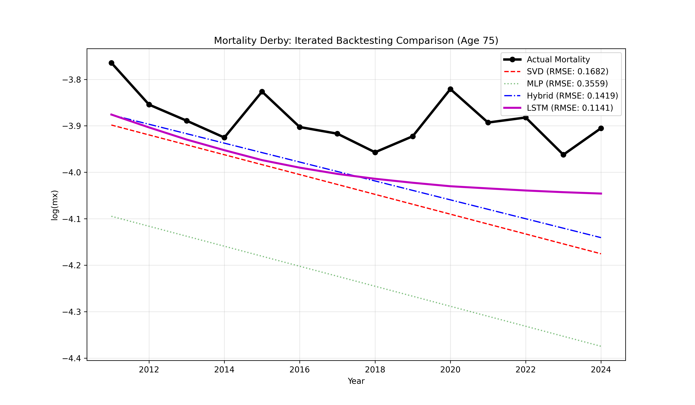
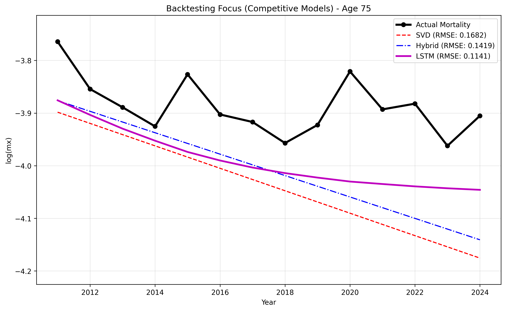

# Project 03: Stochastic Longevity Forecasting: A Neural Approach to SST Capital Calibration

**Author:** [Davide Rindori, PhD](https://www.linkedin.com/in/davide-rindori/)  
**Research Goal:** Modernizing Longevity Risk frameworks for high-income markets through Deep Learning and Regulatory Capital standards.

---

## 📄 Project Documentation
* **[Technical Paper (PDF)](./reports/Stochastic_Longevity_Forecasting_Rindori_2026.pdf)**: Full actuarial report including SST calibration, model risk analysis, and structural bias discussion.
* **[LaTeX Source](./latex/)**: Original source files used for the technical documentation and typesetting.

---

## Executive Summary
This repository implements a **State-of-the-Art Longevity Risk Framework** designed to address the limitations of linear mortality drift in modern demographic regimes. By transitioning from traditional benchmarks to **Probabilistic Deep Learning (LSTM + Monte Carlo Dropout)**, this framework identifies the recent Swiss mortality "regime shifts" and quantifies the **Prudence Gap** required for capital adequacy under **Swiss Solvency Test (SST)** and **Solvency II** standards.

## Key Technical Features
* **Sequential Intelligence:** LSTM-based modeling with a 10-year look-back window to internalize decadal mortality momentum and structural plateaus.
* **Bayesian Uncertainty:** Quantification of **Epistemic Risk** through Monte Carlo Dropout (MCD), generating 100 stochastic forward passes to capture non-symmetric tail risks.
* **Regulatory Calibration:** Automated derivation of **Expected Shortfall (ES 99%)** for Longevity SCR shock calibration, aligning with FINMA requirements.
* **Model Robustness:** Comprehensive sensitivity analysis confirming architectural stability across diverse hyperparameter configurations.

## Visual Insights & Benchmarking

### 1. The "Mortality Derby" (Model Selection)
The framework was validated via out-of-sample backtesting (2011-2024). The LSTM outperformed classical SVD-based benchmarks by adapting to the recent deceleration in mortality improvements.

| Model Architecture | RMSE (2011-2024) | Risk Management Insight |
| :--- | :--- | :--- |
| **SVD Lee-Carter (Baseline)** | 0.1682 | Rigid linear drift; misses the structural plateau. |
| **Hybrid Residual Model** | 0.1419 | Improved graduation but maintains a linear extrapolation bias. |
| **LSTM Champion** | **0.1141** | **Superior adaptation to Swiss regime shifts.** |

*Fig 04a: Full range comparison highlighting the failure of non-sequential MLP baselines.*

*Fig 04b: Focus on competitive models. The LSTM (magenta) effectively tracks the post-2010 mortality plateau.*

### 2. Sensitivity & Stability Analysis
The LSTM was stress-tested against various look-back windows ($L$) and hidden units ($U$). The analysis identified a performance optimum at $L=5, U=32$ (**RMSE: 0.0439**), while confirming that the decadal window ($L=10$) remains the most robust choice for capturing long-term structural shifts.

### 3. Model Risk & The "38-Point Prudence Gap"
By 2050, the **LSTM Median Projection is 38.54 points higher** than the Lee-Carter trend. This divergence quantifies the **Model Risk**: relying on linear assumptions in a decelerating trend environment leads to systemic under-reserving of longevity liabilities.

### 4. Capital Requirements (SST Metrics)
Using Monte Carlo Dropout, we generate a probabilistic distribution for the 2050 mortality index ($k_t$). The skewness of the distribution highlights the "Neural Tail Risk" captured by the model.

* **Best Estimate (Median $k_t$):** -81.88
* **Expected Shortfall (ES 99%):** -85.78
* **Longevity SCR Shock ($\Delta k_t$):** **3.90**

## Repository Structure
* `01_actuarial_baseline_prep.ipynb`: Data ingestion (HMD) and SVD-based parameter extraction ($\alpha_x, \beta_x, k_t$).
* `02_neural_model_selection.ipynb`: Competitive benchmarking, Sensitivity Analysis, and Backtesting.
* `03_model_diagnostics_validation.ipynb`: Residual Heatmaps, Error Analysis, and Actuarial Stress Testing.
* `04_stochastic_projections_capital_metrics.ipynb`: MC Dropout inference, SST calibration, and Final Risk Metrics.

## License & Citation
This project is licensed under the **MIT License**.

**Citation:** *Davide Rindori, PhD. "Stochastic Longevity Forecasting: A Neural Approach to SST Capital Calibration" (2026).*

---
## Contact & Author

**Davide Rindori, PhD** *SAV Actuarial Candidate | Data Scientist / PhD Physics* **LinkedIn:** [linkedin.com/in/davide-rindori/](https://www.linkedin.com/in/davide-rindori/)