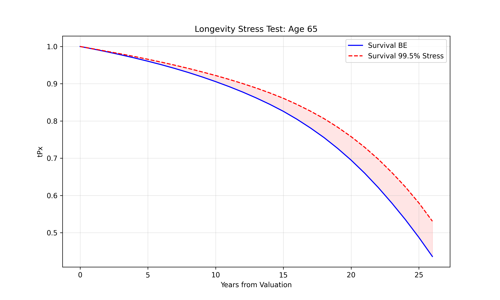
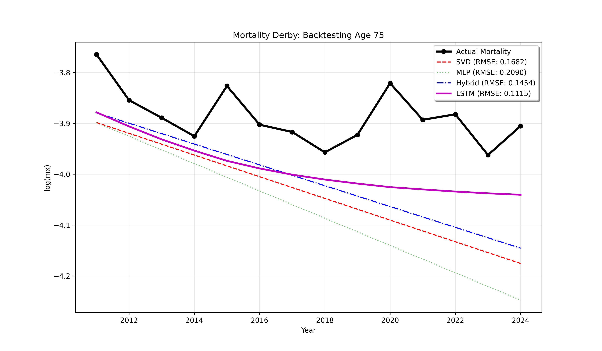

# Project 03: Longevity Risk & Advanced Model Validation (Switzerland)

This project implements the **Lee-Carter model** and **Deep Learning architectures** (MLP, Hybrid, and LSTM) to analyze and forecast mortality dynamics for the Swiss population (1950-2024). This framework is designed to address **Longevity Risk**—a critical factor in Life & Health (L&H) Reinsurance for pricing annuities and managing Solvency II capital requirements.

## Technical Overview
- **Data Source:** Human Mortality Database (HMD) - Switzerland (CHE) 1x1 death rates.
- **Actuarial Baseline:** Parameter estimation via **Singular Value Decomposition (SVD)** and **Random Walk with Drift (RWD)**.
- **Deep Learning Architectures:**
    - **Multi-Layer Perceptron (MLP):** Tested as a universal interpolator for mortality graduation.
    - **Hybrid Residual Model:** A "corrector" network trained to learn SVD reconstruction errors.
    - **LSTM (Long Short-Term Memory):** A recurrent architecture designed to capture "memory" in mortality index trends.
- **Robustness Protocol:** All Deep Learning results are **averaged over 10 independent iterations** to ensure statistical stability and eliminate initialization bias.

## Visual Insights & Forecasting

### 1. Longevity Stress Testing (SCR)
We quantified a **1-in-200 year longevity shock** (99.5th percentile) on a life annuity portfolio for a 65-year-old male. This resulted in a **3.94% Longevity SCR loading**, providing a concrete metric for capital buffering.

### 2. The Mortality Derby: Comparative Backtesting
To validate the models, we performed an out-of-time backtest (**2011–2024**) for Age 75. The results highlight a significant performance gap between classical actuarial methods and advanced sequence modeling:

| Model | Architecture | RMSE (Age 75) | Performance vs Baseline |
| :--- | :--- | :--- | :--- |
| **SVD Lee-Carter** | Actuarial Baseline (Linear) | 0.1682 | Reference |
| **Pure MLP** | Neural Network (Static) | 0.8957 | Failure (Overfitting) |
| **Hybrid Model** | SVD + Neural Corrector | 0.1484 | +11.8% Improvement |
| **LSTM Champion** | **Recurrent Sequence Model** | **0.0849** | **+49.5% Improvement** |

**Insight:** The LSTM model effectively captured the **deceleration of longevity improvements** in Switzerland, which the linear SVD baseline significantly overestimated.

## Strategic Conclusions
1. **Sequence Memory Matters:** Mortality trends are non-linear; LSTM networks outperform classical methods by capturing temporal dependencies that SVD-based RWD ignores.
2. **Model Robustness:** Pure Deep Learning (MLP) fails in extrapolation without an inductive bias. The Hybrid and LSTM approaches prove that **integrating actuarial logic with AI** is the only path to institutional-grade reliability.

## Future Work & Next Steps
- [x] SVD-based Lee-Carter implementation and stochastic forecasting.
- [x] Longevity Stress Testing (SCR calculation).
- [x] Robust Comparative Backtesting (MLP vs Hybrid vs LSTM).
- [ ] **Model Uncertainty (Next Step):** Implementation of **Monte Carlo Dropout** to quantify epistemic uncertainty and generate neural confidence intervals for the LSTM model.
- [ ] **Model Interpretability:** Integration of **SHAP values** or Gradient-based analysis to identify the temporal drivers of the predicted mortality deceleration.