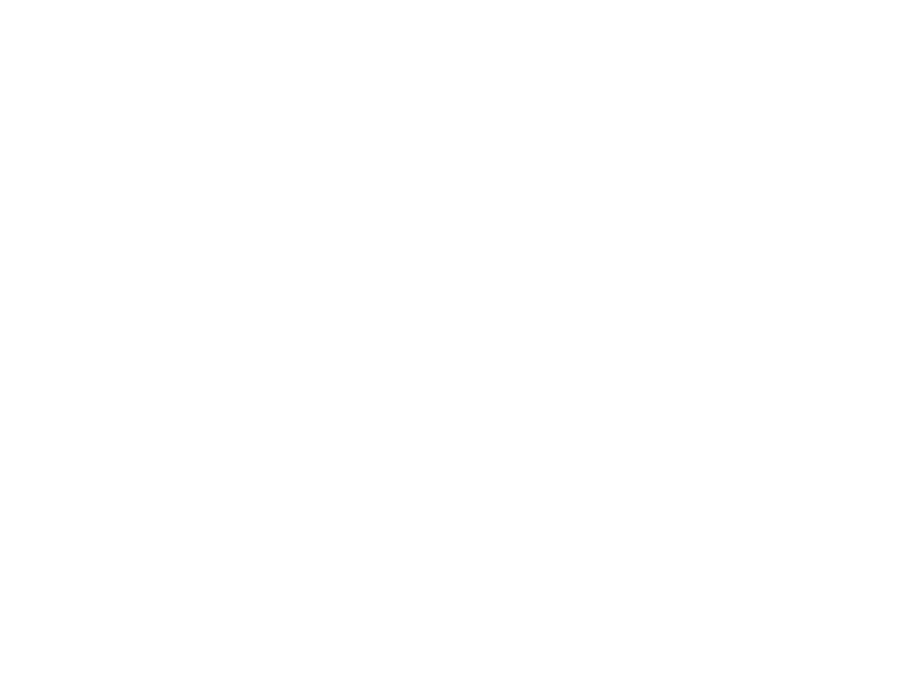
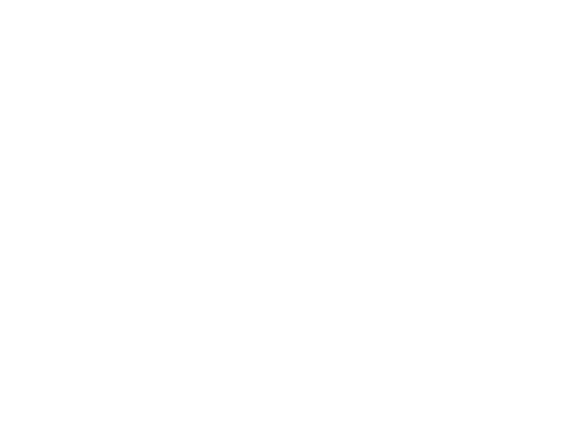
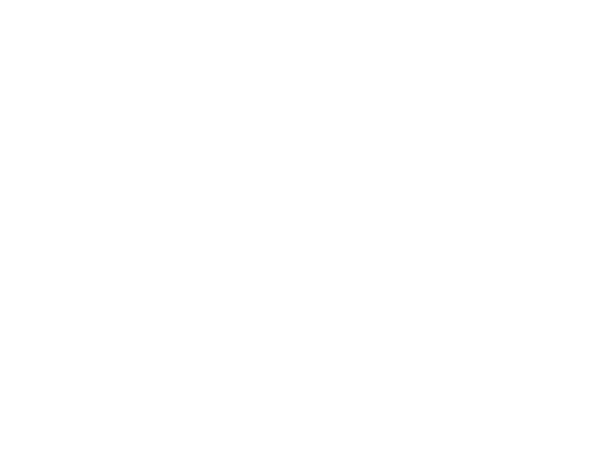

# Project 03: Stochastic Mortality Modeling (Switzerland)

This project implements the **Lee-Carter model** to analyze and forecast mortality dynamics for the Swiss population (1950-2024). Modeling mortality improvement is a core task for Life & Health (L&H) Reinsurance, specifically for quantifying **Longevity Risk**.

## Technical Overview
- **Data Source:** Human Mortality Database (HMD) - Switzerland (CHE) 1x1 death rates.
- **Methodology:** Parameter estimation via **Singular Value Decomposition (SVD)** on the log-mortality matrix.
- **Data Engineering:** Age-clipping at 95 years to ensure statistical robustness and eliminate centenarian noise.

## Visual Insights

### 1. Lexis Surface (Log-Mortality)
The heatmap reveals the historical evolution of Swiss mortality. We observe a clear "darkening" of the surface over time, representing the steady decline in mortality rates (Longevity Improvement) across almost all age groups.

### 2. Lee-Carter Parameters
The SVD decomposes the mortality surface into three interpretable components:
- **$\alpha_x$**: The average age-specific mortality profile (classic J-shape).
- **$\beta_x$**: Age sensitivity to the overall time trend (identifying which generations benefit most from medical progress).
- **$\kappa_t$**: The global mortality index, showing a clear downward secular trend with a visible shock in 2020-2022 (COVID-19).

### 3. Model Diagnostics (Residuals)
The residual analysis shows a high-quality fit for the core population, with noise concentrated only at the oldest ages (90+), confirming the model's reliability for pricing and risk assessment.

## Current Status
- [x] Data processing and Lexis surface visualization.
- [x] SVD-based Lee-Carter implementation and parameter identification.
- [x] Residual diagnostics and age-clipping optimization.
- [ ] **Next Step:** Stochastic forecasting (ARIMA) and Machine Learning (Deep LC) extensions.