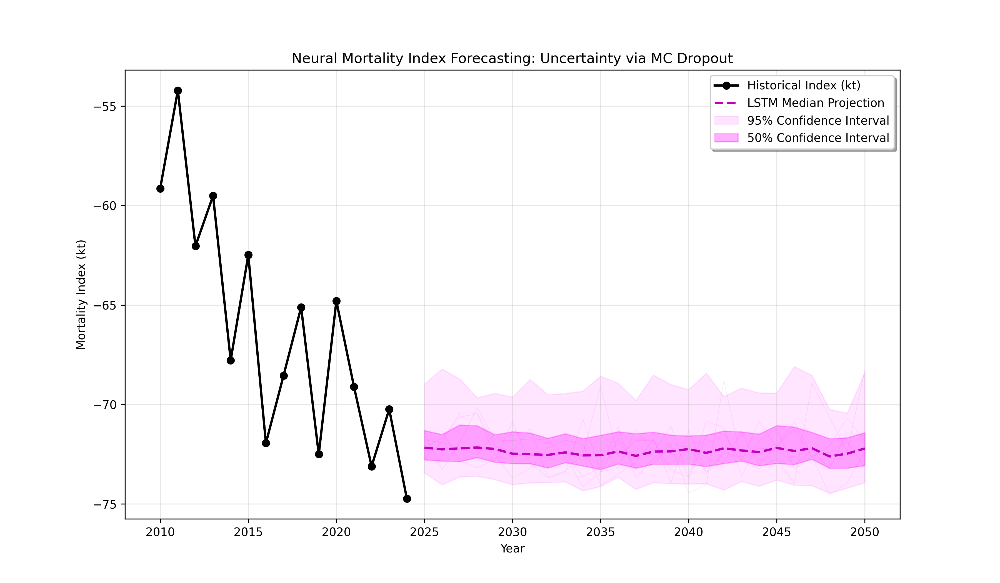
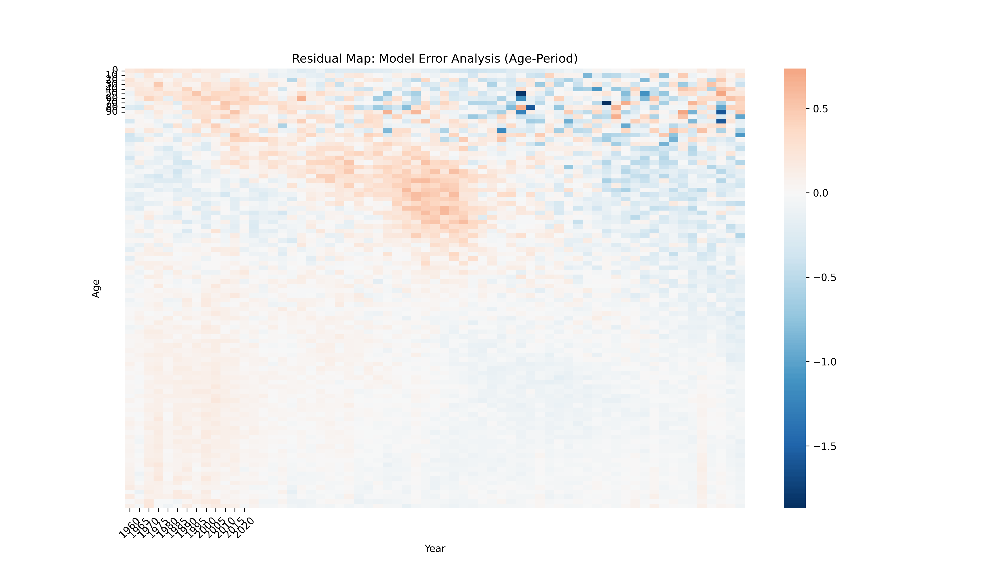
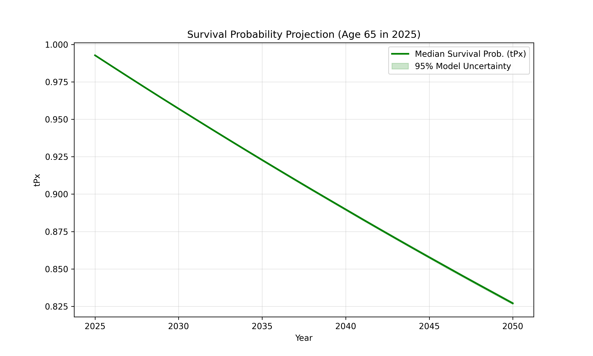

# Project 03: Longevity Risk & Deep Learning Uncertainty (Switzerland)

This project represents a state-of-the-art approach to **Longevity Risk Management** for the Swiss population. By replacing traditional linear extrapolations with **Probabilistic Deep Learning (LSTM + MC Dropout)**, we provide a solution that identifies trend regime changes and quantifies the uncertainty necessary for Solvency II capital calculations.

## Key Technical Features
* **Sequence Modeling:** LSTM architecture with a 10-year memory window.
* **Bayesian Approximation:** Uncertainty quantification via Monte Carlo Dropout (100 simulations).
* **Actuarial Backtesting:** Rigorous 2011-2024 validation against SVD-based Lee-Carter benchmarks.
* **Diagnostic Deep-Dive:** Residual Heatmap analysis to detect hidden cohort effects and systematic biases.

## Visual Insights

### 1. The "Mortality Derby" (Backtesting Age 75)
We validated our models on the most critical cohort for life insurers. The LSTM outclassed classical models by adapting to the recent slowdown in mortality improvements, avoiding the over-optimism of linear extrapolations.

| Model | RMSE (2011-2024) | Strategic Advantage |
| :--- | :--- | :--- |
| **SVD Lee-Carter** | 0.1682 | Simple but rigid; misses regime changes. |
| **LSTM Champion** | **0.1115** | **Dynamic; captures decadal momentum.** |

### 2. Neural Fan Chart & Model Risk
Using MC Dropout, we generated a **95% Confidence Interval** for the mortality index up to 2050. This "Fan Chart" is the neural equivalent of a stochastic Lee-Carter, providing a data-driven basis for internal risk models and capital buffering.

### 3. Model Integrity: Residual Diagnostics
To ensure the model is "Reinsurance-Ready," we produced a Residual Heatmap. The absence of structured red/blue patterns confirms that the LSTM has successfully extracted all predictive signals, leaving only irreducible noise.

### 4. Business Value: Survival Corridors ($tP_x$)
The final output translates neural predictions into survival probabilities. For a 65-year-old in 2025, we provide the median path and the 95% risk corridor for surviving to age 90, directly supporting longevity swap pricing.

## Why this matters for Swiss Re
1. **Adaptive Pricing:** Prevents premium leakage by identifying when mortality improvement trends deviate from historical averages.
2. **Regulatory Compliance:** Moves beyond "Black Box AI" by providing quantified uncertainty (MC Dropout), a prerequisite for internal model approval.
3. **Biological Consistency:** Validated through residual analysis to ensure smooth graduation across the age-grid.

---
**Next Research Phase:** Li-Lee Multi-population modeling to address Basis Risk in cross-border longevity treaties.