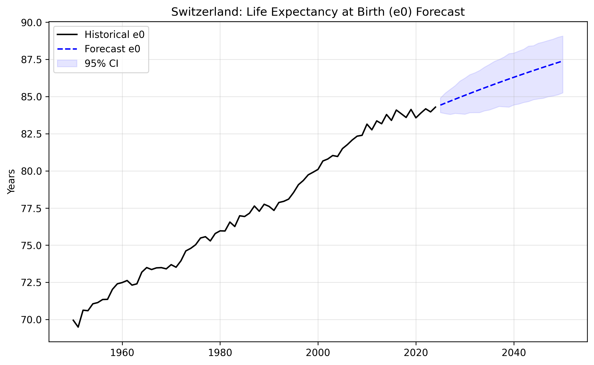

# Project 03: Stochastic Mortality Modeling (Switzerland)

This project implements the **Lee-Carter model** and **Deep Learning extensions** to analyze and forecast mortality dynamics for the Swiss population (1950-2024). Modeling mortality improvement is a core task for Life & Health (L&H) Reinsurance, specifically for quantifying **Longevity Risk** and pricing annuities.

## Technical Overview
- **Data Source:** Human Mortality Database (HMD) - Switzerland (CHE) 1x1 death rates.
- **Baseline Methodology:** Parameter estimation via **Singular Value Decomposition (SVD)** with strict identifiability constraints ($\sum \beta_x = 1$).
- **Forecasting:** Stochastic projection of the mortality index ($\kappa_t$) using a **Random Walk with Drift (RWD)**.
- **Machine Learning:** Implementation of a **Deep Lee-Carter** (Neural Network) for non-linear mortality smoothing (graduation).
- **Data Engineering:** Age-clipping at 95 years to ensure statistical robustness and eliminate centenarian noise.

## Visual Insights & Forecasting

### 1. Stochastic Projection of $\kappa_t$
The mortality index $\kappa_t$ is projected to 2050. The Fan Chart captures the inherent uncertainty of longevity improvements, essential for calculating Solvency Capital Requirements (SCR). The model successfully absorbs the 2020-2022 COVID-19 shock as a transitory deviation from the secular trend.

### 2. Life Expectancy at Birth ($e_0$)
Transforming stochastic indices into years of life, we project Swiss life expectancy to reach ~87.5 years by 2050. The 95% confidence interval highlights the "Longevity Risk" - the financial risk that policyholders live longer than the mean expectation.

### 3. Deep Learning Graduation (Neural Smoothing)
To address the limitations of the linear SVD approach, a **Multi-Layer Perceptron (MLP)** was trained to map $(Age, Year) \rightarrow \ln(m_{x,t})$. 
- **Regularization:** Employed **Dropout (0.1)** and **Early Stopping** to prevent overfitting and ensure the network acts as a robust universal interpolator.
- **Result:** The Neural Surface (right) effectively "repairs" the raw data noise, especially in low-exposure cohorts (young ages), providing a superior basis for mortality table graduation.

## Model Robustness & "Actuarial Challenges"
- **Identifiability:** SVD parameters are normalized to ensure unique solutions, avoiding arbitrary scaling.
- **Smoothing vs. Noise:** The Deep LC model serves as a non-parametric smoother, capturing cohort-specific interactions that traditional 1-factor models might miss.
- **Tail Risk:** Data is truncated at 95 to avoid the "closure problem"; for practical reinsurance pricing, a parametric law (e.g., Kannisto) would be used to extrapolate the 95+ tail.

## Current Status
- [x] Data processing and Lexis surface visualization.
- [x] SVD-based Lee-Carter implementation and residual diagnostics.
- [x] Stochastic forecasting (RWD) and Life Expectancy simulations.
- [x] Neural Network (Deep LC) implementation for mortality graduation.
- [ ] **Next Step:** Impact of Mortality Shocks on Solvency II Capital (Simulation).