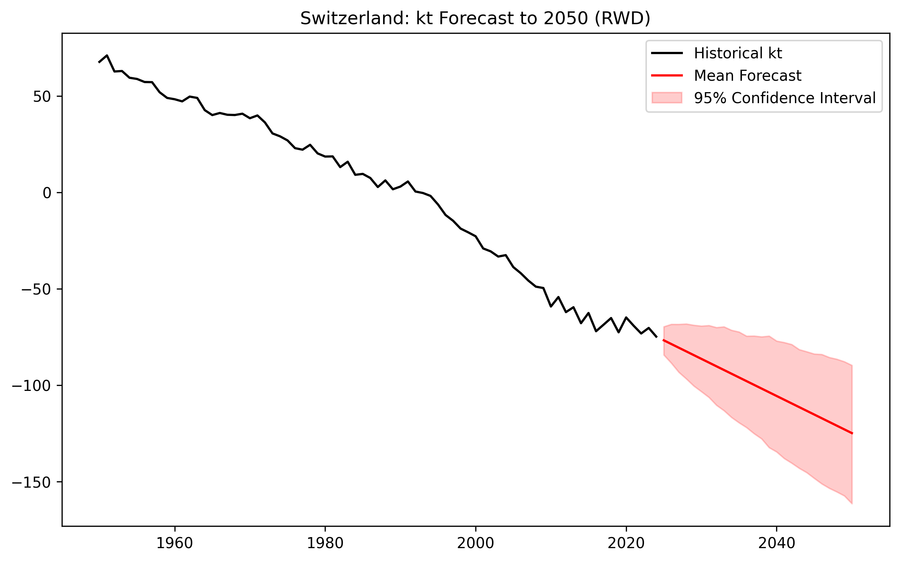
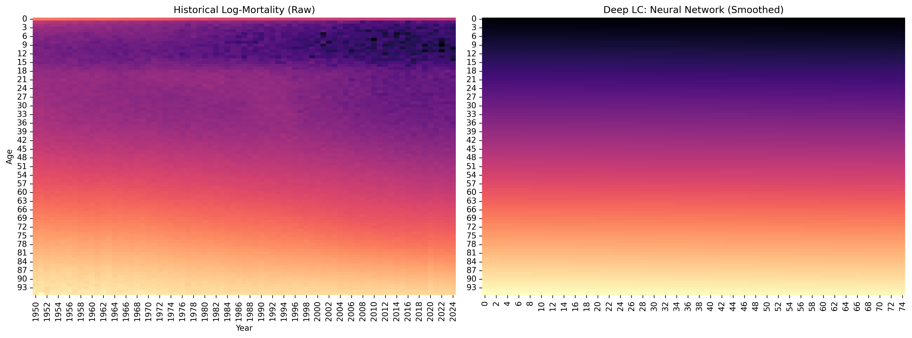
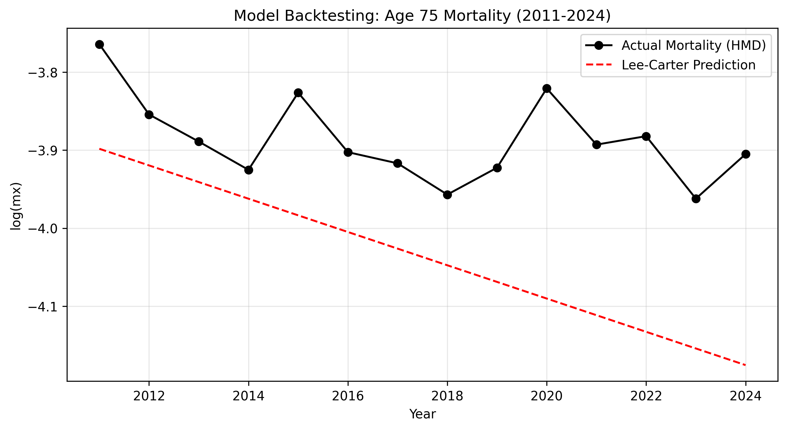

# Project 03: Stochastic Mortality Modeling (Switzerland)

This project implements the **Lee-Carter model** and **Deep Learning extensions** to analyze and forecast mortality dynamics for the Swiss population (1950-2024). Modeling mortality improvement is a core task for Life & Health (L&H) Reinsurance, specifically for quantifying **Longevity Risk** and pricing annuities.

## Technical Overview
- **Data Source:** Human Mortality Database (HMD) - Switzerland (CHE) 1x1 death rates.
- **Baseline Methodology:** Parameter estimation via **Singular Value Decomposition (SVD)** with strict identifiability constraints ($\sum \beta_x = 1$).
- **Forecasting:** Stochastic projection of the mortality index ($\kappa_t$) using a **Random Walk with Drift (RWD)**.
- **Machine Learning:** Implementation of a **Deep Lee-Carter** (Neural Network) for non-linear mortality smoothing (graduation).
- **Risk Management:** Longevity Stress Testing (SCR calculation) and out-of-time Backtesting.

## Visual Insights & Forecasting

### 1. Stochastic Projection of $\kappa_t$
The mortality index $\kappa_t$ is projected to 2050. The Fan Chart captures the inherent uncertainty of longevity improvements, essential for calculating Solvency Capital Requirements (SCR).

### 2. Deep Learning Graduation (Neural Smoothing)
A **Multi-Layer Perceptron (MLP)** was trained to map $(Age, Year) \rightarrow \ln(m_{x,t})$, acting as a robust universal interpolator to "repair" raw data noise.

### 3. Longevity Stress Testing & Backtesting
- **Stress Test:** Quantified a 1-in-200 year longevity shock on a life annuity portfolio (65-year-old male), resulting in a **3.94% Longevity SCR loading**.
- **Model Validation:** Out-of-time backtesting (2011-2024) yielded an **RMSE of 0.1682** for Age 75, identifying a deceleration in longevity trends.

## Future Work & Model Evolution (Next Steps)
To further align this framework with institutional **Model Validation** and **ALM** standards, the following steps are planned:
1. **Comparative Backtesting:** Evaluate the Deep Lee-Carter (Neural Network) performance against the SVD baseline in the 2011-2024 test period to quantify the "ML lift".
2. **Sensitivity Analysis (Greeks):** Implement a sensitivity matrix to assess the impact of interest rate fluctuations on Longevity SCR (Asset-Liability Management integration).
3. **Model Interpretability:** Apply SHAP values to the Deep LC model to identify specific age-cohort drivers of mortality improvement.
4. **Cause-of-Death Decomposition:** Transition from a general mortality model to a cause-specific framework to better capture biometrical risk drivers.

## Current Status
- [x] SVD-based Lee-Carter implementation and stochastic forecasting.
- [x] Neural Network (Deep LC) implementation for mortality graduation.
- [x] Longevity Stress Testing (SCR calculation).
- [x] Baseline Model Validation (Backtesting).
- [ ] **Next Step:** Comparative Backtesting (SVD vs. Deep LC).