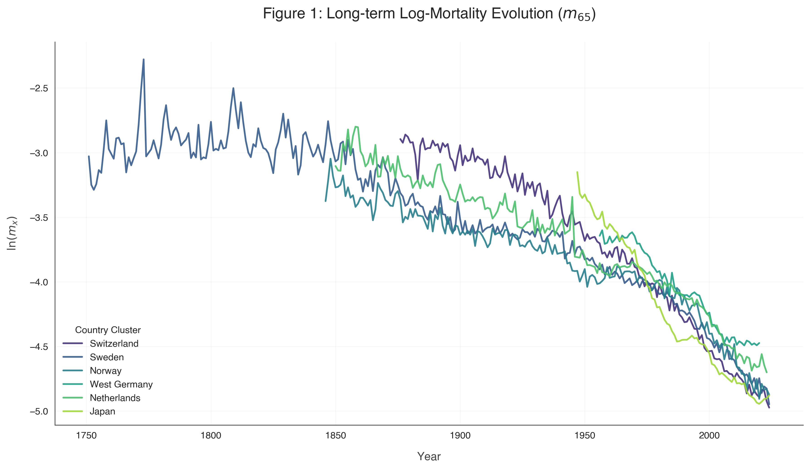

# Project 04: Multi-Population Longevity Forecasting with XAI

Research pipeline for forecasting mortality rates across a 6-country cluster (CHE, SWE, NOR, DEUTW, NLD, JPN) using classical actuarial models (Lee-Carter, Li-Lee) and Deep Learning (LSTM) with Explainable AI (XAI).

## Key Visualization

## Project Structure
- `data/`: Processed mortality data (Raw .txt files are git-ignored).
- `notebooks/`: 
    - `01_data_extraction_and_eda.ipynb`: Data ingestion and professional EDA.
    - `02_actuarial_benchmarking.ipynb`: Lee-Carter & Li-Lee implementation (In Progress).
- `reports/figures/`: High-resolution visualizations (Viridis/Helvetica/Centered).

## Standards
- **Palette**: Viridis (Perceptually Uniform).
- **Typography**: Helvetica / Sans-Serif.
- **Source**: Human Mortality Database (HMD).