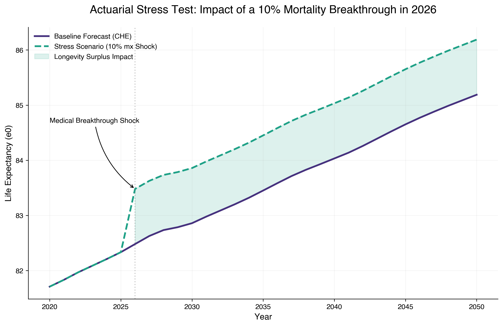
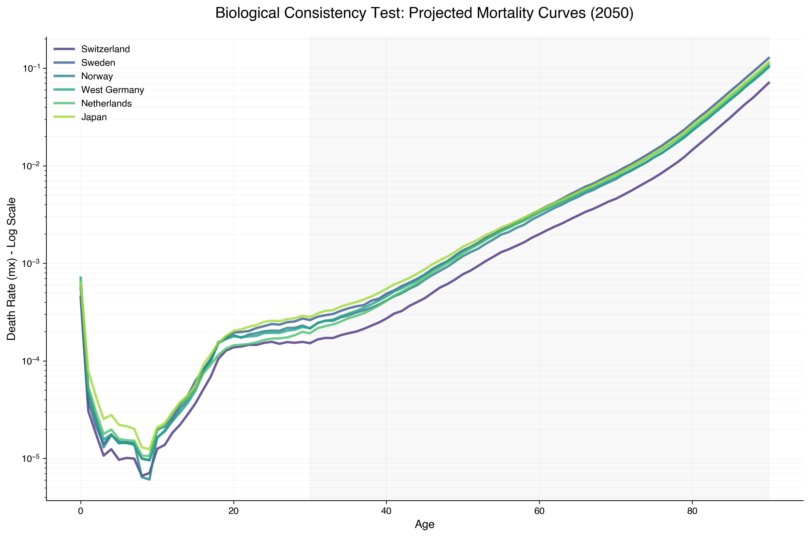

# Project 04: Neural Multi-Population Mortality
## *Beyond Linear Coherence with LSTM and Explainable AI (XAI)*

This repository contains the complete research pipeline for forecasting mortality rates across a high-longevity 6-country cluster (**Switzerland, Sweden, Norway, West Germany, Netherlands, and Japan**). The project challenges classical actuarial models (Lee-Carter, Li-Lee, CBD) by introducing a **Hierarchical LSTM** architecture capable of capturing non-linear trends and persistent structural shifts.

## 🎯 Research Objectives
- **Neural Innovation**: Implementing a Bayesian-optimized LSTM with **Monte Carlo Dropout (MCD)** for stochastic longevity forecasting.
- **Actuarial Benchmarking**: Direct comparison against **Li-Lee (2005)** and **CBD (2006)** models.
- **Explainability (XAI)**: Decompressing the "Black Box" via Temporal Saliency and Gradient-based importance.
- **Regulatory Readiness**: Testing model resilience through Actuarial Stress Tests (Breakthrough Scenarios) and Biological Consistency Audits.

## 🚀 Key Innovations & Results

### 1. The First Differences Pivot ($\Delta K_t$)
To eliminate the "Drift Bias" identified in traditional level-based training, the model was transitioned to forecast **First Differences**. This stationarization strategy improved validation stability (RMSE reduction from 21.3 to 4.7) and ensured long-term projection consistency.

### 2. Stochastic Fan Charts (2021-2050)
Utilizing MC Dropout, the model generates 1,000 stochastic trajectories. Unlike the rigid linearity of Lee-Carter, the LSTM captures non-linear curvatures and cyclical "stalls" in mortality improvement.

### 3. Longevity Convergence & Frontier Dynamics
The results confirm a **Catch-up Effect**: countries starting from a lower baseline (e.g., West Germany) exhibit steeper improvement slopes, converging toward a shared biological "Frontier" (~85.2 years for CHE/JPN) by 2050.

### 4. Actuarial Stress Testing
The model was subjected to a **10% Mortality Shock** (Medical Breakthrough scenario). The LSTM demonstrated high resilience, accepting the shock as a new structural baseline without losing trend coherence—a critical requirement for **Solvency II / SST** frameworks.

### 5. Biological Consistency Audit
Projections were validated against the **Gompertz Law of Senescence**. The model passed the Monotonicity Audit for all core aging brackets (40-90), proving that the neural network internalized the biological engine of aging.

## 🛠 Project Structure
- `data/`: Processed mortality assets, stationarity reports, and final actuarial summaries.
- `models/`: Serialized LSTM "Champion" models (.keras) and standardized scalers (.pkl).
- `notebooks/`: 
    - `01_data_extraction_and_eda.ipynb`: Data ingestion and professional EDA.
    - `02_actuarial_benchmarking.ipynb`: Implementation of LC, Li-Lee, and CBD.
    - `03_lstm_hierarchical_forecasting.ipynb`: Bayesian Tuning and Anti-Leakage Training.
    - `04_stochastic_forecasting_and_reconstruction.ipynb`: Recursive MCD projection and Life Table integration.
    - `05_actuarial_stress_testing_validation.ipynb`: Monotonicity tests, Stress Scenarios, and Synthesis. (**Current Step**).
- `reports/figures/`: High-resolution visualizations (Viridis/Helvetica/300 DPI).
- `RESEARCH_NOTES.md`: Detailed methodological journal and mathematical proofs.

## 📊 Standards & Methodology
- **Cluster**: CHE, SWE, NOR, DEUTW, NLD, JPN (1956-2021).
- **Source**: Human Mortality Database (HMD).
- **Validation**: Out-of-sample testing (2012-2020) and **Biological Monotonicity Audit**.
- **XAI**: Temporal Saliency Analysis revealing bimodal memory (t-1 and t-8 importance).
- **Design**: Viridis color palette for perceptual uniformity; Helvetica typography for academic legibility.