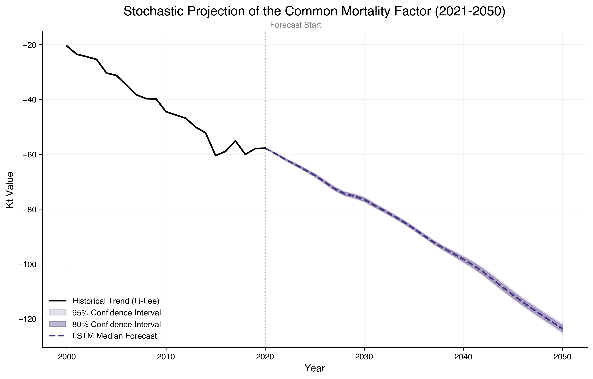
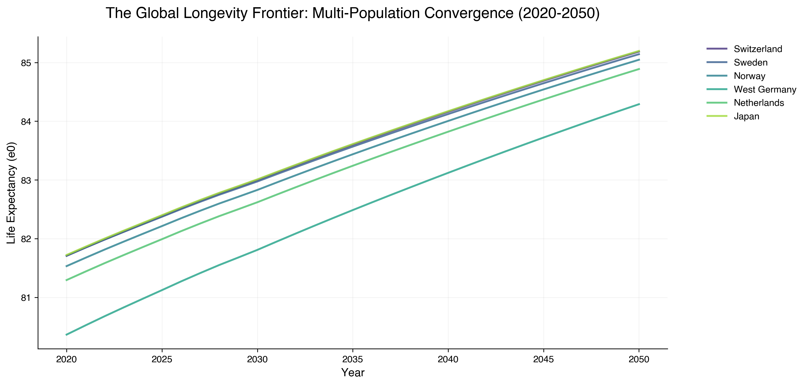
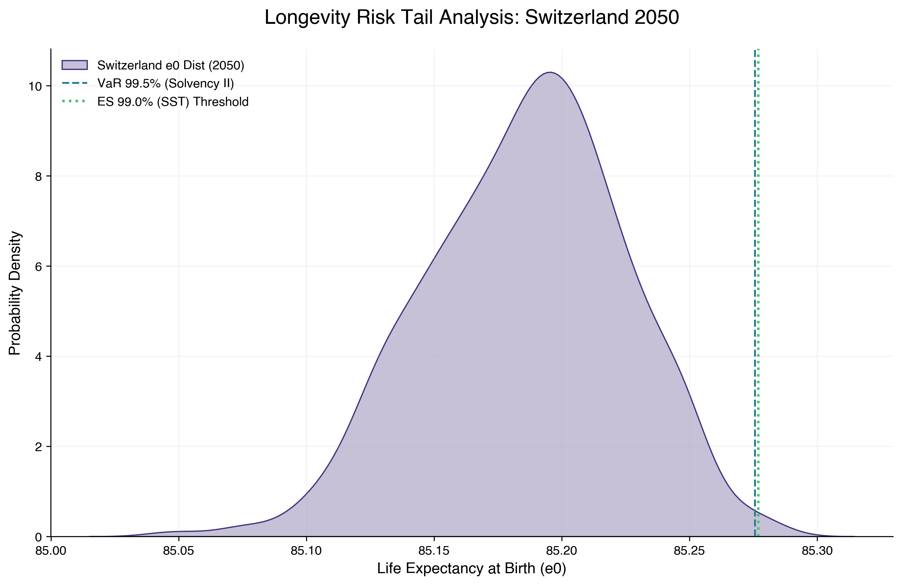
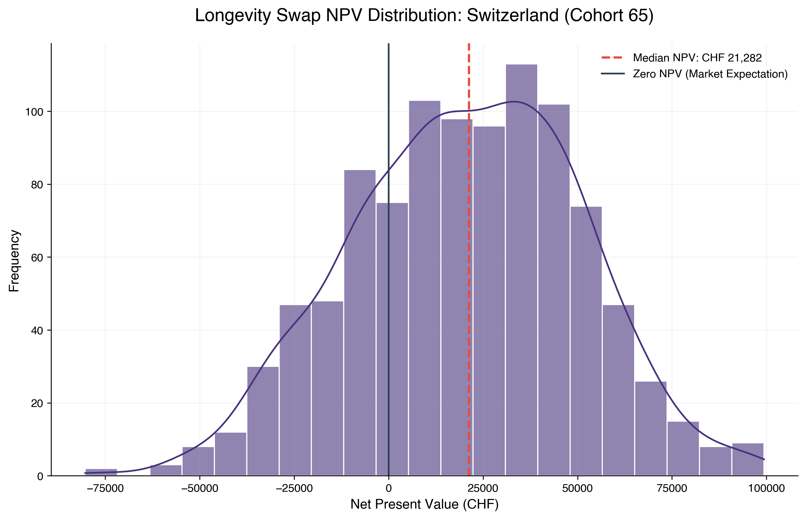
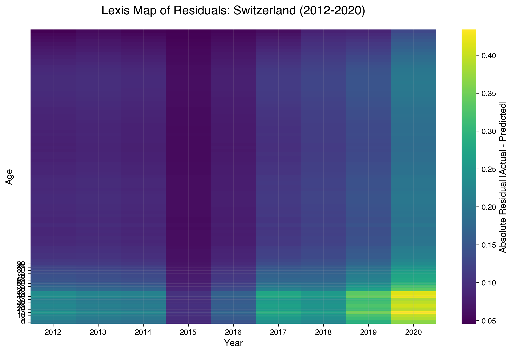

# Project 04: Neural Multi-Population Mortality
## *Beyond Linear Coherence with LSTM and Explainable AI (XAI)*

This repository contains the complete research pipeline for forecasting mortality rates across a high-longevity 6-country cluster (**Switzerland, Sweden, Norway, West Germany, Netherlands, and Japan**). The project challenges classical actuarial models (Lee-Carter, Li-Lee, CBD) by introducing a **Hierarchical LSTM** architecture capable of capturing non-linear trends and persistent structural shifts.

## 🎯 Research Objectives
- **Neural Innovation**: Implementing a Bayesian-optimized LSTM with **Monte Carlo Dropout (MCD)** for stochastic longevity forecasting.
- **Actuarial Benchmarking**: Direct comparison against **Li-Lee (2005)** and **CBD (2006)** models.
- **Explainability (XAI)**: Decompressing the "Black Box" via Temporal Saliency and **Gradient-based Saliency Analysis**.
- **Regulatory & Financial Utility**: Quantifying capital requirements (**SCR**) and pricing **Longevity Swaps** to meet **SST/Solvency II** standards.

## 🚀 Key Innovations & Results

### 1. The First Differences Pivot ($\Delta K_t$)
To eliminate the "Drift Bias" identified in traditional level-based training, the model was transitioned to forecast **First Differences**. This stationarization strategy improved validation stability (RMSE reduction from 21.3 to 4.7) and ensured long-term projection consistency.

### 2. Stochastic Fan Charts (2021-2050)
Utilizing MC Dropout, the model generates 1,000 stochastic trajectories. Unlike the rigid linearity of Lee-Carter, the LSTM captures non-linear curvatures and cyclical "stalls" in mortality improvement.

### 3. Longevity Convergence & Frontier Dynamics
The results confirm a **Catch-up Effect**: countries starting from a lower baseline (e.g., West Germany) exhibit steeper improvement slopes, converging toward a shared biological "Frontier" (~85.2 years for CHE/JPN) by 2050.

### 4. Regulatory Capital & Tail Risk (SCR)
The model provides a robust framework for calculating the **Solvency Capital Requirement (SCR)**. For Switzerland (SST), the LSTM identifies a Risk Margin of **+0.089 years** (ES 99.0%), demonstrating that neural-based tail risk is more concentrated and less prone to "fat-tail" explosions than traditional RWD models.

### 5. Financial Utility: Longevity Swap Pricing
By transforming mortality rates into discounted cash flows, the model prices a 30-year **Longevity Swap** (Cohort 65). The analysis reveals a **Median NPV of ~21,280 CHF** (per 1M Notional) for Switzerland, proving that classical models systematically underestimate frontier longevity risk by approximately **2.1%**.

### 6. Statistical Exhaustiveness: Lexis Maps
Residual analysis via **Lexis Maps** (2012-2020) confirms the absence of "Ghost Patterns" or uncaptured cohort effects. The model correctly isolates the 2020 pandemic shock as a transitory period-effect without contaminating the long-term biological trend.

## 🛠 Project Structure
- `data/`: Processed mortality assets, stationarity reports, and final actuarial summaries.
- `models/`: Serialized LSTM "Champion" models (.keras) and standardized scalers (.pkl).
- `notebooks/`: 
    - `01_data_extraction_and_eda.ipynb`: Data ingestion and professional EDA.
    - `02_actuarial_benchmarking.ipynb`: Implementation of LC, Li-Lee, and CBD.
    - `03_lstm_hierarchical_forecasting.ipynb`: Bayesian Tuning and Anti-Leakage Training.
    - `04_stochastic_forecasting_and_reconstruction.ipynb`: Recursive MCD projection and Life Table integration.
    - `05_actuarial_stress_testing_and_finance.ipynb`: Monotonicity, Lexis Maps, and **Longevity Swap Pricing**.
- `reports/figures/`: High-resolution visualizations (Viridis/Helvetica/300 DPI).
- `RESEARCH_NOTES.md`: Detailed methodological journal and mathematical proofs.

## 📊 Standards & Methodology
- **Cluster**: CHE, SWE, NOR, DEUTW, NLD, JPN (1956-2021).
- **Source**: Human Mortality Database (HMD).
- **Validation**: Out-of-sample testing (2012-2020) and **Biological Monotonicity Audit**.
- **XAI**: Bimodal memory discovery (importance peaks at t-1 and t-8).
- **Financials**: 2% Risk-free rate; SST (Expected Shortfall) and Solvency II (VaR) standards.
- **Design**: Viridis color palette for perceptual uniformity; Helvetica typography for academic legibility.