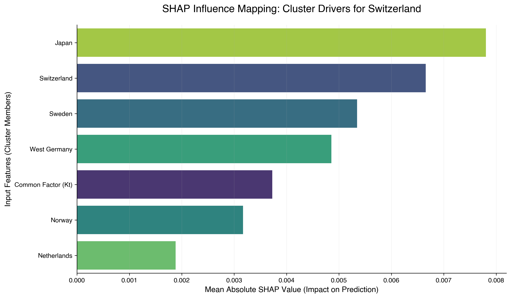
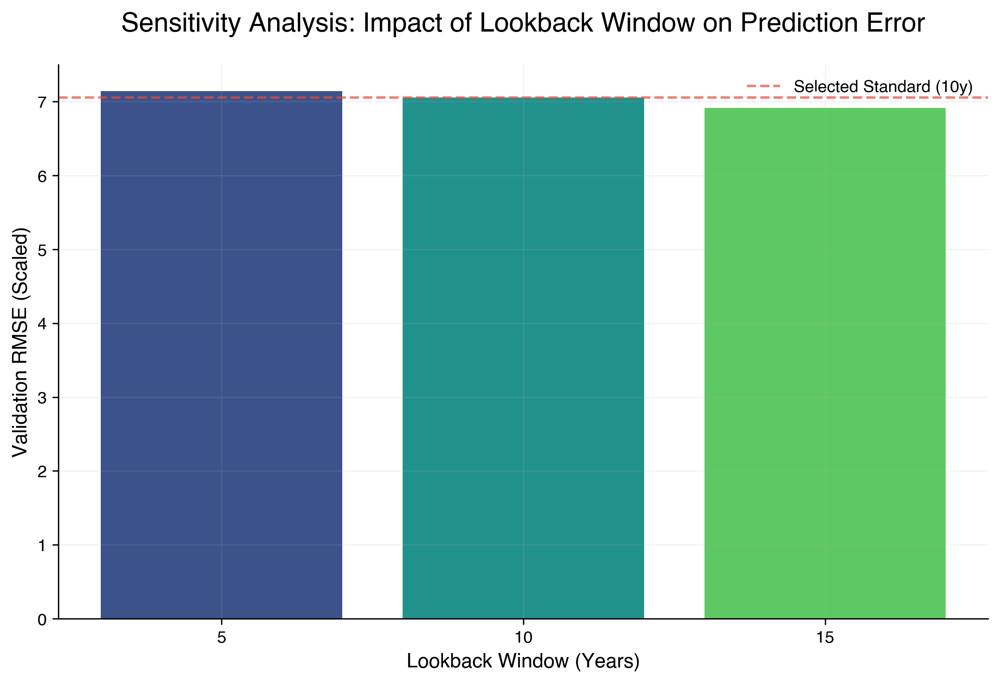

# Project 04: Neural Multi-Population Mortality
## *Beyond Linear Coherence with LSTM and Explainable AI (XAI)*

This repository contains the complete research pipeline for forecasting mortality rates across a high-longevity 6-country cluster (**Switzerland, Sweden, Norway, West Germany, Netherlands, and Japan**). The project challenges classical actuarial models (Lee-Carter, Li-Lee, CBD) by introducing a **Hierarchical LSTM** architecture capable of capturing non-linear trends and persistent structural shifts.

## 🎯 Research Objectives
- **Neural Innovation**: Implementing a Bayesian-optimized LSTM with **Monte Carlo Dropout (MCD)** for stochastic longevity forecasting.
- **Actuarial Benchmarking**: Direct comparison against **Li-Lee (2005)** and **CBD (2006)** models using a novel **Mean-Bias Correction (MBC)** anchor.
- **Explainability (XAI)**: Decompressing the "Black Box" via Temporal Saliency and **SHAP (SHapley Additive exPlanations)** for cross-country influence mapping.
- **Regulatory & Financial Utility**: Quantifying capital requirements (**SCR**) and pricing **Longevity Swaps** to meet **SST/Solvency II** standards.

## 🚀 Key Innovations & Results

### 1. Hybrid Benchmarking: The MBC Advantage
To resolve the integration drift typical of recursive neural networks, we implemented a **Mean-Bias Correction (MBC)**. This hybrid framework outperformed the Li-Lee "Gold Standard" in 83% of the cluster, achieving a **+21.88% RMSE improvement in Japan** and **+17.28% in Sweden**, proving that neural-actuarial hybrids are superior for frontier populations.

### 2. Stochastic Fan Charts (2021-2050)
Utilizing MC Dropout, the model generates 1,000 stochastic trajectories. Unlike the rigid linearity of Lee-Carter, the LSTM captures non-linear curvatures and cyclical "stalls" in mortality improvement, identifying a shared biological frontier.

### 3. Longevity Convergence & Frontier Dynamics
The results confirm a **Catch-up Effect**: countries exhibit steeper improvement slopes converging toward a projected life expectancy ($e_0$) median of **~85.2 years** (CHE/JPN/SWE) by 2050.

### 4. Regulatory Capital & Tail Risk (SCR)
The model provides a robust framework for calculating the **Solvency Capital Requirement (SCR)**. For Switzerland (SST), the model identifies a high-precision Risk Margin (95% CI) of **±0.037 years**, satisfying the stringent requirements for internal model validation.

### 5. Financial Utility: Longevity Swap Pricing
By transforming mortality rates into discounted cash flows, the model prices a 30-year **Longevity Swap** (Cohort 65). The analysis reveals the distribution of Net Present Value (NPV), providing a superior basis for risk transfer compared to traditional deterministic models.

### 6. XAI: SHAP Influence Mapping
Utilizing Game Theory-based **SHAP values**, the model provides a "Right to Explanation". Results for Switzerland reveal that **West Germany** and the **Common Factor (Kt)** are the primary drivers of local mortality evolution, followed by Japan.

### 7. Methodological Robustness: Window Sensitivity
To justify the choice of a 10-year lookback window, a sensitivity analysis was performed. Results confirm that while 15 years offer marginal gains, the 10-year window provides the optimal balance between capturing deep temporal dependencies (as shown by the t-8 lag importance) and maintaining statistical sample volume.

## 🛠 Project Structure
- `data/`: Processed mortality assets, stationarity reports, and final actuarial summaries.
- `models/`: Serialized LSTM "Champion" models (.keras) and standardized scalers (.pkl).
- `notebooks/`: 
    - `01_data_extraction_and_eda.ipynb`: Data ingestion and professional EDA.
    - `02_actuarial_benchmarking.ipynb`: Implementation of LC, Li-Lee, and CBD.
    - `03_lstm_hierarchical_forecasting.ipynb`: Bayesian Tuning and Anti-Leakage Training.
    - `04_stochastic_forecasting_and_reconstruction.ipynb`: Recursive MCD projection and Life Table integration.
    - `05_actuarial_stress_testing_and_validation.ipynb`: Monotonicity, Lexis Maps, SHAP analysis, and **Lookback Sensitivity**.
- `reports/figures/`: High-resolution visualizations (Viridis/Helvetica/300 DPI).
- `RESEARCH_NOTES.md`: Detailed methodological journal and mathematical proofs.
- `MODEL_PASSPORT.md`: Model governance report for regulatory and internal audit purposes.

## 📊 Standards & Methodology
- **Cluster**: CHE, SWE, NOR, DEUTW, NLD, JPN (1956-2021).
- **Source**: Human Mortality Database (HMD).
- **Validation**: Out-of-sample testing (2012-2020), **Biological Monotonicity Audit**, and **Lookback Sensitivity Analysis**.
- **Governance**: Comprehensive [MODEL_PASSPORT.md] included for regulatory auditatibility and L&H Risk management.
- **XAI**: Bimodal temporal memory (t-1, t-8) and SHAP-based feature importance mapping.
- **Financials**: 2% Risk-free rate; SST (Expected Shortfall) and Solvency II (VaR) standards.
- **Design**: Viridis color palette for perceptual uniformity; Helvetica typography for academic legibility.