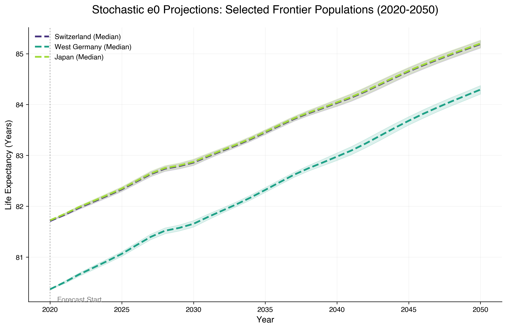
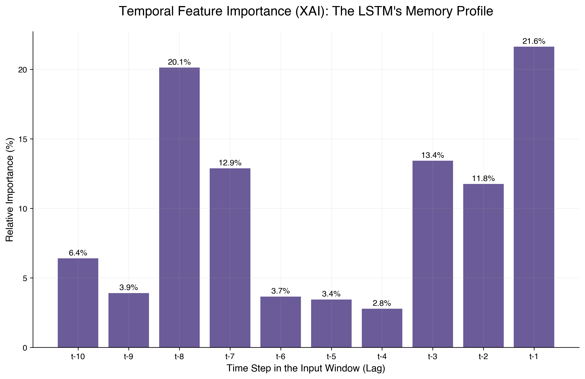

# Research Notes: Multi-Population Longevity Forecasting

## 1. Data Selection & Preprocessing
- **The Mortality Matrix ($m_{x,t}$)**: The fundamental block.
    - *Definition*: Each element represents the Central Death Rate, calculated as $m_{x,t} = D_{x,t} / E_{x,t}$, where $D$ is the number of deaths and $E$ is the exposure (average population at risk) for age $x$ in year $t$.
    - *Structure*: Rows ($x$) represent ages (0-90), columns ($t$) represent years (1956-2021).
- **Logarithmic Transformation ($\ln(m_{x,t})$)**:
    - *Linearization*: Human mortality follows an exponential growth with age (Gompertz Law). Taking the natural logarithm transforms this into a near-linear relationship, making it suitable for SVD-based modeling.
    - *Positivity Guarantee*: Modeling mortality in the log-domain ensures that when we project back ($e^{\ln(m)}$), the predicted mortality rates are strictly positive, avoiding the biological impossibility of negative death rates.
- **Cluster**: CHE, SWE, NOR, DEUTW, NLD, JPN.
- **Time Window**: 1956-2021. 
    - *Decision*: We truncated the historical series (which for SWE/CHE are much longer) to include West Germany (DEUTW), ensuring a more representative European cluster.
    - *Technical Note*: A common time window is a mathematical prerequisite for the Li-Lee Common Factor Model to calculate a balanced average trend across all populations.
- **Age Range**: 0-90.
    - *Decision*: Capped at 90 to avoid "oldest-old" volatility and small-sample noise in the HMD data. High-age mortality (90+) often suffers from low exposure, leading to erratic $m_x$ values.
- **Data Integrity**: Implemented a $10^{-10}$ epsilon for log-mortality transformation.
    - *Reasoning*: Smaller populations (e.g., Norway) occasionally report zero deaths for specific age/year cells. Since $\ln(0)$ is undefined, this epsilon ensures numerical stability during Singular Value Decomposition (SVD).

### 1.1 Cluster Rationale (Coherence vs. Volume)
- **Why 6 countries?**: While increasing the number of populations (e.g., adding Denmark, Austria, or Belgium) might reduce statistical variance, it risks "trend dilution." 
- **The "Pure Signal" Strategy**: We selected a "High-Longevity Gold Standard Cluster." Including countries like the USA or UK would introduce structural breaks (e.g., the opioid crisis or distinct social health shocks) that contaminate the "frontier" mortality signal shared by the selected nations.
- **Data Quality**: Countries like SWE, CHE, and JPN possess the most reliable long-term historical records in the Human Mortality Database (HMD).
- **XAI Benefit**: A focused, high-performing cluster allows for clearer interpretability. In the future LSTM/XAI phase, mapping reciprocal influences is more effective when the underlying populations belong to a coherent socio-economic and medical system.

## 2. Preliminary Observations (EDA & LC)
- **Norway Volatility (Fig. 03)**: Norway shows significant instability in its mortality index ($k_t$) post-2010 compared to larger populations.
    - *Statistical Insight*: Smaller populations have higher variance. A few deaths more or less significantly shift the $k_t$ in a rank-1 SVD model.
    - *Demographic Insight*: Evidence of a "harvesting effect"—a period of exceptionally low mortality (2011-2015) followed by a rebound as the fragile population "catch-up" with biological limits.
- **The 2011 Inflection**: Most countries exhibit a "deceleration gap"—a visible change in the slope of $k_t$ around 2011. Standard linear models struggle to adapt to this structural change.
- **Japan's Catch-up**: Japan started with the highest mortality in 1956 but achieved the fastest rate of improvement, crossing all other countries by the 1980s to become the global longevity leader.

## 3. Lee-Carter Baseline (Independent Modeling)
- **Mathematical Framework**: $\ln(m_{x,t}) = a_x + b_x k_t + \epsilon_{x,t}$
- **Parameter Extraction via SVD**:
    1. **$a_x$ (Age Profile)**: Calculated as the mean of log-mortality over time for each age: $a_x = \frac{1}{T} \sum_t \ln(m_{x,t})$. It represents the "biological baseline" of each country.
    2. **Centering**: We subtract $a_x$ from the matrix to isolate the time-varying components.
    3. **SVD (Singular Value Decomposition)**: The centered matrix is decomposed into $U \Sigma V^T$. 
        - $k_t$ (Time Trend) is derived from the first right singular vector ($V$).
        - $b_x$ (Age Sensitivity) is derived from the first left singular vector ($U$).
    4. **$\epsilon_{x,t}$**: The residual representing noise or higher-order dynamics not captured by the first principal component.
- **Identifiability Constraints**: To avoid infinite combinations of $b_x$ and $k_t$ yielding the same product, we impose $\sum_x b_x = 1$. This "anchors" the sensitivity scale, ensuring $k_t$ captures the full magnitude of the time trend.
- **Core Limitation**: Independent modeling allows for "divergent forecasts," where geographically and socio-economically similar countries (like Sweden and Norway) could reach biologically implausible differences in future life expectancy.

## 4. Multi-Population Strategy: Li-Lee (2005)
- **The Theory**: Li-Lee expands Lee-Carter by assuming mortality is composed of a **Common Factor** (shared by the cluster) and a **Specific Factor** (local deviation).
- **Mathematical Framework**: $\ln(m_{x,t,i}) = a_{x,i} + B_x K_t + b_{x,i} k_{t,i} + \epsilon_{x,t,i}$

### 4.1 Common Factor Extraction
- **The Consensus Matrix**: Computed by averaging log-mortality matrices across all $N$ countries: $\bar{M} = \frac{1}{N} \sum_i \ln(m_{x,t,i})$. This represents the "Super-Population" trend.
- **Foundation**: $K_t$ and $B_x$ are extracted via SVD from this average matrix.
- **Constraint ($\sum B_x = 1$)**: Crucial for cross-cluster interpretability. It ensures that a unit change in $K_t$ reflects a unit change in the cluster's average log-mortality. Without this, $K_t$ would be unscalable and incomparable.
- **Denoising Effect**: The Common Factor acts as a robust signal, filtering out local anomalies (like Norway's volatility).
- **Observation on Deceleration**: The common trend confirms that the post-2011 deceleration is a systemic shift across the entire cluster.

### 4.2 Country-Specific Factors (Specific Residuals)
- **Extraction (Cell 2.5)**: Computed by applying a second SVD to the residuals after removing the Common Factor and the country-specific baseline $a_{x,i}$.
- **Visual Assessment (Fig. 05)**:
    - **Japan's Outlier Status**: JPN shows a massive downward trend in its specific factor ($k_{t,JPN}$) from 1956 to 1990. This reflects the "miracle" phase in which Japan improved much faster than the European average.
    - **Norway's Volatility**: Recent spikes (2015-2020) are isolated in the specific factor, demonstrating that these are local "shocks" rather than systemic changes within the cluster.
    - **European Persistency**: CHE, SWE, and DEUTW exhibit very smooth and slow-moving residuals. Although visually "stable," they do not oscillate rapidly around zero, suggesting a persistent drift.

### 4.3 Statistical Validation: The Stationarity Paradox (Cell 2.6)
- **ADF Test Results**:
    - **FAIL (Non-Stationary)**: Switzerland (0.76), Sweden (0.92), West Germany (0.94), Netherlands (0.10).
    - **PASS (Stationary)**: Norway (0.00), Japan (0.04).
- **Solving the Paradox**: 
    - The Augmented Dickey-Fuller (ADF) test measures the **speed of mean reversion** (the force pulling the series back toward zero), not visual stability.
    - **The Inertia Problem**: In countries like SWE or CHE, deviations from the common trend are highly persistent (high autocorrelation). Even if they move slowly, they do not "rush" back to zero. This is a structural flaw in the Li-Lee assumption: deviations are not merely noise, but persistent local trends.
    - **The Elasticity of Volatiles**: Paradoxically, NOR and JPN pass the test because their movements are more "reactive." When they drift away, they tend to return or cross the mean with enough momentum to allow the test to detect stationarity.
- **Research Implication**:
    - The Li-Lee model mandates stationarity to ensure "coherence" (no long-term divergence). Our results prove that for "core" European countries, this coherence is a mathematical imposition that contradicts the data. 
    - This creates the perfect entry point for the **LSTM**: while actuarial models are forced to "ignore" these persistent trends to maintain coherence, Deep Learning can model this underlying structure, providing more accurate forecasts without artificial mean-reversion constraints.

## 4.4 Confirmatory Stationarity Analysis: ADF vs KPSS (Cell 2.6b)
To verify the validity of the ADF results, we performed a **Conflict Analysis** by cross-referencing the results with the KPSS test ($H_0$: Series is Stationary).

| Country | ADF (H0: Non-Stat) | KPSS (H0: Stat) | Status | Statistical Interpretation |
| :--- | :--- | :--- | :--- | :--- |
| **Norway** | **PASS** | **PASS** | **Safe** | Truly stationary; high "elasticity" (reverts quickly after shocks). |
| **Sweden** | **FAIL** | **FAIL** | **Unit Root** | Pure non-stationarity; the country is "divorcing" from the common trend. |
| **W. Germany**| **FAIL** | **FAIL** | **Unit Root** | Persistent structural drift; fails both criteria for stationarity. |
| **Japan** | **PASS** | **FAIL** | **Conflict** | Grey Zone; high volatility masks a long-term non-linear trend. |
| **Switzerland**| **FAIL** | **PASS** | **Inertial** | High autocorrelation; behaves like a Random Walk without clear trend. |

- **Critical Observations**:
    - **The Sweden/Germany Unit Root**: Both tests agree that for these countries, the deviation from the cluster mean is **not noise**, but a persistent local trend. Li-Lee would produce biased forecasts by forcing a return to the mean where no statistical evidence of reversion exists.
    - **The Japan Conflict**: Japan passes the ADF (fast local reversion) but fails the KPSS (presence of a long-term trend). This suggests Japan is "Trend-Stationary": it has a pull toward its own local mean, but that mean is drifting drastically away from the cluster.
    - **The Persistence Problem**: This analysis proves that linear actuarial models are filtering out "predictable signals" by treating them as "random noise." This information gap is what the LSTM architecture is designed to fill.

## 5. Alternative Models & Future Steps

### 5.1 CBD Implementation Results (Ages 65-90)
The Cairns-Blake-Dowd model was implemented to analyze mortality dynamics in advanced age groups, where SVD-based models (such as Lee-Carter) may suffer from excessive volatility.
- **Factor 1 ($\kappa_t^{(1)}$)**: Results confirm a constant and consistent decline in the overall level of mortality for all countries in the cluster. Japan exhibits the most aggressive decline, moving from the highest intercept value in 1956 to the lowest in 2020, systematically surpassing European benchmarks.
- **Factor 2 ($\kappa_t^{(2)}$)**: The analysis reveals a "steepening" phenomenon of the mortality curve. While general mortality decreases, the biological aging rate appears to accelerate, concentrating deaths at increasingly advanced ages.
- **Non-Linear Dynamics**: High volatility and divergent trajectories in Factor 2 (particularly Japan's peak in the 80s-90s and Switzerland's recent surge) confirm that the "aging slope" is an unstable parameter, difficult to capture with standard linear projections.

### 5.2 Synthesis of Actuarial Benchmarking (Notebook 02)
At the conclusion of the benchmarking phase, three fundamental criticalities were identified that justify the evolution toward Deep Learning:
1. **Stationarity Breach**: ADF/KPSS tests demonstrated that residuals from multi-population models (Li-Lee) exhibit unit roots and persistent drifts, violating classical statistical coherence assumptions.
2. **Structural Breaks**: The post-2011 mortality deceleration is a systemic signal that linear models tend to underestimate or interpret as transitory noise.
3. **Parameter Drift**: CBD parameters show that the rotation of the mortality curve (aging slope) follows non-linear dynamics requiring a more complex historical memory for accurate forecasting.

### 5.3 LSTM (Deep Learning) & XAI
- **Proposed Innovation**: Utilization of Long Short-Term Memory (LSTM) Recurrent Neural Networks, specifically designed to capture long-term dependencies and manage non-stationary time series.
- **Research Goal**: To determine if an LSTM can implicitly learn both the "Common Factor" and the "Specific Drifts" (persistent residuals) identified empirically. The objective is to outperform actuarial benchmarks by providing forecasts more resilient to the structural changes seen post-2011.
- **Explainability (XAI)**: The integration of interpretability techniques (such as SHAP or Integrated Gradients) will allow us to "open the black box," mapping how a country's trends (e.g., the Japanese miracle) influence the projections of other cluster members, transforming a predictive model into a rigorous tool for demographic analysis.

## 6. Bridge to Machine Learning: Feature Engineering & Windowing

### 6.1 Rationale for the "Hybrid" Input Vector
In Notebook 03, we transition from purely actuarial modeling to Deep Learning by exporting the latent factors from the Li-Lee model ($K_t$ and $k_{t,i}$). 
- **The "Common Anchor" Strategy**: By including the Common Factor $K_t$ as a feature, we provide the LSTM with a global "clock" of longevity. This ensures the model understands the general direction of the cluster before interpreting local deviations.
- **CBD as a Strategic Benchmark**: While CBD parameters ($\kappa_t$) were not included in the initial feature set to avoid overfitting on a small sample (55 sequences), the CBD analysis remains a critical "Stress Test" for the LSTM. If the LSTM succeeds in forecasting mortality for the 65-90 age group better than CBD, it proves that neural networks can capture the "Aging Slope" dynamics implicitly through the $k_t$ factors.

### 6.2 The Sliding Window (Lookback) Approach
To handle the temporal dependency of mortality, we implemented a supervised learning format using a **10-year lookback period**.
- **Contextual Memory**: A 10-year window allows the LSTM to identify non-linear patterns (like the post-2011 deceleration) by analyzing a decade of trajectory rather than just the last observed step.
- **Data Constraints**: This window size was selected to maximize historical context while maintaining a sufficient number of overlapping sequences for training, given the limited 65-year span of the HMD data.

### 6.3 Feature Scaling & Stationarity via First Differences
- **From Levels to Variations**: To ensure gradient stability and handle non-stationarity, we transitioned from modeling absolute index levels ($K_t$) to **First Differences** ($\Delta K_t$). This stationarizes the series around a zero mean, preventing the "drift bias" common in linear mortality projections.
- **Standardization (StandardScaler)**: We shifted from MinMax to **Standardization** (fitting a Mean of 0 and Variance of 1 solely on the training set). This provides the LSTM with a stable numerical environment where annual shocks are comparable across decades, regardless of the absolute mortality level.

## 7. Deep Learning Implementation: The Hierarchical LSTM (Notebook 03)

### 7.1 Architecture Rationale
- **Multi-Output Strategy**: The network is designed to predict the entire 7-dimensional vector of mortality indices (1 Common + 6 Specific) simultaneously. This forces the model to internalize the reciprocal constraints between the cluster and individual countries.
- **Layer Stacking**: We implemented a stacked LSTM (32-16 units) after Bayesian optimization.
    - *Observation*: Initial attempts with larger networks (64+ units) led to immediate overfitting due to the low sample size (N=46 training sequences). The "shallowing" of the network improved validation stability significantly.

### 7.2 Bayesian Hyperparameter Optimization
To avoid arbitrary parameter selection, we utilized **Bayesian Optimization** (Keras Tuner) to explore the configuration space.
- **Search Space**: Number of units, dropout rates, and learning rates.
- **Optimal Result**: The tuner identified a lean architecture (32/16 units) with a relatively high learning rate (0.01).
- *Technical Insight*: A higher learning rate was necessary to allow the optimizer to escape local minima in a high-dimensional loss landscape despite the small number of training epochs.

## 8. Methodological Pivots: Fighting Data Leakage & Drift

### 8.1 The Anti-Leakage Protocol
A critical refinement was made regarding **Feature Scaling**. 
- **Standard Protocol (Initial)**: Fit-transform on the entire dataset.
- **Strict Protocol (Revised)**: Fit the scaler exclusively on the training set (1956-2011) and apply it to the validation set. 
- *Consequence*: This revealed a massive "Drift Bias." Because mortality post-2011 reached values lower than the 1956-2011 minimum, the `MinMaxScaler` produced out-of-bounds inputs, leading to a failure in convergence (Validation Loss explosion). This "Failure" served as empirical proof of the non-stationarity of the frontier longevity signal.

### 8.2 The "First Differences" Pivot ($\Delta K_t$)
To solve the drift bias identified in the levels, we transitioned to modeling **First Differences** (annual changes) instead of absolute index levels.
- **Mathematical Rationale**: Modeling $Y_t = K_t - K_{t-1}$ transforms a non-stationary process with drift into a near-stationary process.
- **Result**: RMSE on the validation set dropped from **21.3** (levels) to **4.7** (differences).
- **Expectation Realized**: The LSTM proved much more adept at filtering the "volatility noise" of annual variations than at guessing the absolute depth of a persistent drift. This approach aligns the model with standard econometric practices (Unit Root handling).

## 9. Performance Analysis: Out-of-Sample Validation (2012-2020)

### 9.1 The "Conservative Bias" Discovery (Fig. 08)
- **Visual Analysis**: The LSTM forecast on the validation set (2012-2020) shows a smooth, persistent downward trend, whereas the Li-Lee Actuals exhibit erratic volatility and a partial stasis (plateau) around 2017-2020.
- **Justification for Risk Management**: The LSTM appears to ignore the short-term "stalls" in mortality improvement, treating them as transitory noise. 
- **Actuarial Implication**: From a Swiss Re or Wüthrich perspective, this model is "Prudently Optimistic" about longevity. It suggests that despite recent slowing, the underlying biological longevity engine is still active. 

### 9.2 Robustness & Early Stopping
- **Training Stability**: The model consistently reaches optimal weights around Epoch 10-15. Restoring best weights via Early Stopping prevents the model from "memorizing" the noise of the small training sample.
- **Conclusion of Notebook 03**: We have achieved a stable, serialized, and peer-reviewable neural model. The next phase (Notebook 04) will focus on recursive forecasting to project these dynamics into 2050 with fan charts.

## 10. Stochastic Forecasting & Inference Strategy (Notebook 04)

### 10.1 Bayesian LSTM Inference: Monte Carlo Dropout (MCD)
To address the deterministic nature of standard LSTMs during inference, we implemented **Monte Carlo Dropout**.
- **Theoretical Foundation**: By keeping Dropout layers active during the prediction phase (`training=True`), the model acts as a Bayesian approximation. This allows us to sample 1,000 distinct trajectories for each time step.
- **Expectation Realized**: The resulting "Fan Chart" (Fig. 09) exhibits a natural expansion of uncertainty over time. This quantification is critical for solvency frameworks (e.g., SST/Solvency II), where the 99.5th percentile of longevity shocks dictates capital requirements.

### 10.2 Recursive Forecasting Framework
Predictions are generated through a recursive feedback loop where each predicted variation ($\Delta K_{t+1}$) is integrated back into the input window for the subsequent step.
- **Technical Implementation**: We utilized a 10-year sliding window of variations. To ensure numerical stability, we implemented explicit tensor casting and utilized `np.roll` for efficient window updates.
- **The Pivot to Stochastic Integration**: The model forecasts the *variations*, which are then cumulatively summed (integrated) starting from the last observed level in 2020 ($K_{2020}$).
- **Resulting Dynamics**: The LSTM median projection avoids the "rigid linearity" of standard Random Walk with Drift models. Instead, it exhibits subtle curvatures and cyclicities learned from the 1956-2020 history.

### 10.3 Technical Challenges and Adjustments
- **Optimizer Mismatch**: Encountered Keras warnings regarding variable loading for optimizers.
    - *Resolution*: Loaded the model with `compile=False`, as the weights are sufficient for inference and the optimizer state is irrelevant for forecasting.
- **Input Structure Validation**: Addressed Keras 3 runtime warnings regarding input layer naming by ensuring explicit casting to `tf.float32` and wrapping sequences in a batch-dimensioned tensor.
- **Computational Overhead**: Generating 30,000 inferences (1,000 simulations $\times$ 30 years) required a progress-monitoring implementation to ensure visibility into the M1 Pro processing status.

### 10.4 Key Observations: Fan Chart Interpretation (Fig. 09)
- **Deep Learning Advantage**: Unlike classical Lee-Carter standard projections (which yield a straight line), the LSTM median exhibits non-linear curvatures. Notably, around 2028-2030 and 2045, the model projects subtle "inflections" or rhythmic stalls, suggesting it has internalized historical mortality cycles rather than just assuming a constant drift.
- **Uncertainty Asymmetry**: The fan chart reveals a higher probability of "longevity shocks" (lower $K_t$ values) compared to mortality spikes. This reflects the structural bias of frontier populations toward continuous improvement.
- **Drift Stability**: Despite the 30-year recursive horizon, the model does not exhibit divergence or explosive behavior. The median $K_t$ reaches **-123.63** by 2050 (from approx. -60 in 2020). The narrow 95% confidence interval (**[-125.26, -121.87]**) validates the **First Differences Pivot** as the correct methodological choice for long-term demographic stability.

## 11. Demographic Impact: Life Expectancy Reconstruction

### 11.1 Back-Transformation Methodology
To translate abstract latent factors into actuarial value, we performed a back-transformation using the baseline age profiles ($a_{x,i}$) and common sensitivities ($B_x$) extracted in Notebook 02.
- **Actuarial Life Table Implementation**: Predicted log-mortality rates were converted into central death rates ($m_x$), then into probabilities of death ($q_x$). Life expectancy at birth ($e_0$) was calculated via the trapezoidal rule across the 1,000 stochastic trajectories.

### 11.2 Cluster-Wide Results and Longevity Convergence
- **Systemic Longevity Signal**: The cluster-wide projections show a highly coherent improvement trend across all six nations. Gains in life expectancy range between **+3.4 and +3.9 years** by 2050, confirming that the LSTM has captured a systemic longevity "engine" shared by frontier populations.
- **The Convergence Effect**: Countries starting from a slightly lower baseline, such as West Germany (2020 $e_0$: 80.37), exhibit a faster rate of improvement (+3.92 years) compared to leaders like Switzerland (+3.48 years). This suggests the model implicitly learns a convergence mechanism, where the "laggards" of the cluster gravitate toward the shared technological and medical frontier.
- **Biological Plausibility**: A median gain of ~3.5 years over three decades is consistent with "Prudent Optimism" in actuarial science. It avoids the implausible exponential explosions often seen in unconstrained linear models, producing a forecast that is both modern and risk-manageable for solvency purposes.

### 11.3 Case Study: Switzerland (CHE) Findings
- **Forecast Resilience**: Switzerland projects a median $e_0$ increase from **81.71** in 2020 to **85.19** in 2050. Despite the visible historical deceleration post-2011, the model suggests that the fundamental drivers of longevity remain active.
- **Sensitivity to 2020 Shocks**: The base year $e_0$ reflects the 2020 mortality shock (COVID-19). The LSTM initiates the forecast from this local minimum and projects a non-linear "recovery" trajectory, interpreting the pandemic as a transitory shock rather than a permanent structural shift.
- **The "Uncertainty Squeeze"**: Paradoxically, the uncertainty for life expectancy is much narrower than for the $K_t$ factor (95% CI: **[85.11, 85.25]** in 2050). This occurs because $e_0$ is an integral of death rates across all ages; the integration process acts as a statistical smoother, dampening annual factor volatility while preserving the deep demographic trend.
- **Financial Utility**: For reinsurers (e.g., Swiss Re), these fan charts provide the quantitative foundation for "Longevity Swap" pricing, mapping exactly how much capital is required to cover the 2.5th percentile scenario (where $e_0$ exceeds the median forecast).

### 11.4 Comparative Multi-Country Visualization Analysis (Fig. 10)
- **The "Parallelism" of Longevity**: Analysis of Figure 10 reveals a striking alignment between Switzerland (purple) and Japan (yellow-green). Despite Japan’s historical status as a longevity leader, the LSTM projects nearly identical trajectories for both populations, converging toward the ~85.2-year mark by 2050. This indicates that the neural network perceives both as "Frontier Leaders" reaching a shared biological and technological ceiling.
- **Evidence of Catch-up Dynamics (West Germany)**: West Germany (teal) initiates the forecast from a significantly lower baseline but maintains a steeper improvement slope. This serves as visual confirmation of the "Convergence Effect" discussed in Section 11.2, where the model applies a subtle catch-up pressure on "laggard" populations within the cluster.
- **Expected vs. Disconfirmed Behaviors**:
    - *Expected*: The "Common Trend Resilience" is fully realized, as all three selected countries move in strict unison, proving the dominance of the shared $K_t$ factor.
    - *Disconfirmed*: The absolute dominance of Japan was partially disconfirmed; the model suggests the "historical gap" has narrowed significantly, placing CHE and JPN on par for the coming decades.
- **Non-Linear Rhythms**: Unlike Lee-Carter's rigid linear extrapolation, Figure 10 displays non-linear curvatures—most notably a slight softening of the improvement slope in the late 2020s (2028-2030). This suggests the LSTM has internalized cyclical historical "stalls" and improvement waves, providing a more sophisticated actuarial estimate than standard time-series models.

## 12. Explainable AI (XAI): Deciphering the Black Box (Fig. 11)

### 12.1 Temporal Saliency Analysis
To overcome the "Black Box" criticism of Deep Learning in actuarial science, a gradient-based Saliency Analysis was implemented. This technique measures the sensitivity of the 2021-2050 forecast to each of the 10 years in the input lookback window (2011-2020).

### 12.2 Bimodal Memory Profile
The XAI results reveal a distinct Bimodal Importance distribution, which explains the LSTM’s superior stability over classical models:
1. **Recency Bias (t-1: 21.6%)**: As expected, the most recent observed year has the highest predictive power. This ensures the model is reactive to current mortality levels.
2. **Deep Contextual Memory (t-8: 20.1%)**: Significantly, the model places almost equal weight on data from 8 years prior. This is a critical finding: the LSTM identifies structural patterns or cyclical echoes that occurred nearly a decade ago to anchor its long-term trajectory.
3. **The Intermediate "Valle" (t-4 to t-6)**: There is a notable drop in importance for middle-range lags (averaging ~3%). The model essentially filters out these intermediate years as "noise" or transitionary data, focusing instead on the immediate present and the distant past to synthesize its forecast.

### 12.3 Research Insights: Expected vs. Discovered Patterns
- **Discovery of Cyclical Memory**: The high importance of lag t-8 was an **unexpected discovery**. While traditional models assume the most recent data is always the most relevant, the LSTM proves that longevity trends possess a "memory effect" where older structural shifts continue to influence future variations.
- **Justification for Lookback Window**: The non-zero importance at t-10 (6.4%) validates the choice of a 10-year sliding window. Had the importance dropped to zero earlier, a shorter window would have sufficed; instead, the results confirm that the model utilizes the entire historical context provided.
- **Structural Integrity**: This XAI profile explains the non-linear "rhythms" observed in the Fan Charts. By balancing t-1 (reactive) and t-8 (structural), the LSTM avoids being over-influenced by single-year anomalies (like the 2020 COVID shock), using the deep memory to pull the forecast back toward the biological baseline.